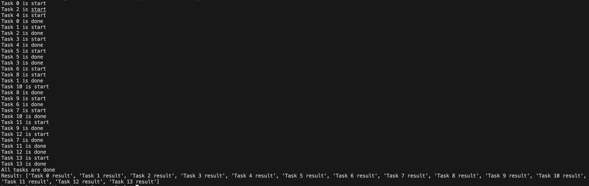

# นายพัฒนชัย พันธุ์เกตุ

## Process Pool คือ
Process Pool คือกลไกที่ใช้ใน Python สำหรับการจัดการการประมวลผลแบบหลายกระบวนการ (parallel processing) โดยใช้ฟีเจอร์จากโมดูล multiprocessing ซึ่งช่วยให้สามารถกระจายงานออกไปทำในหลายกระบวนการย่อยๆ ได้พร้อมกัน ซึ่งเป็นวิธีหนึ่งในการใช้ประโยชน์จากหลายคอร์ของ CPU ให้เต็มประสิทธิภาพ

## ทำงานอย่างไร
Process Pool จะสร้างชุดของกระบวนการย่อยขึ้นมา ซึ่งเรียกว่า "workers"
โดยผู้ใช้สามารถระบุจำนวนกระบวนการได้ตามต้องการ (เช่น จำนวนคอร์ในเครื่อง)
งานจะถูกส่งเข้าไปยัง "workers" เหล่านี้เพื่อทำงานพร้อมกัน
กระบวนการย่อยจะประมวลผลงานของมัน และส่งผลลัพธ์กลับมาหลังจากเสร็จสิ้น


```bash
# ฟังก์ชันที่ต้องการให้กระบวนการย่อยทำงาน
def task(name):
    print(f"Task {name} is start")
    time.sleep(2) # จำลองงานที่ใช้เวลาประมวลผล
    print(f"Task {name} is done")
    return f"Task {name} result"

if __name__ == "__main__":
    # สร้าง process pool มี worker 3 ตัว
    with Pool(3) as pool:
        # ใช้ map ส่งงานไปให้ workers
        results = pool.map(task, range(14))  # ส่งให้ 14 งาน แต่ pool มี 3 workers

    # แสดงผลลัพธ์เมื่อทุกงานเสร็จสิ้น
    print("All tasks are done")
    print("Result:", results)
```

### อธิบายโค้ด
ให้ import Pool เพื่อให้สามารถจัดการกับงานแบบหลายกระบวนการ (processes) ได้โดยง่ายโดย Pool จะช่วยสร้างกลุ่มของกระบวนการ (workers) 
และจัดการการทำงานต่างๆ โดยไม่ต้องสร้างกระบวนการแต่ละตัวเอง

ในโค้ดใช้ Pool(3) เพื่อสร้าง pool ที่มี 3 workers หมายความว่าในคราวเดียวจะมีงานได้สูงสุด 3 งานที่ถูกประมวลผลพร้อมกัน

```bash
pool.map(task, range(14))
```
ทำให้ process pool เรียกฟังก์ชัน task จำนวน 14 ครั้ง (ตั้งแต่ 0 ถึง 13) โดยแต่ละครั้งจะส่งไปที่ workers ที่มีอยู่
ฟังก์ชัน task จะจำลองการทำงานที่ใช้เวลานานด้วยการใช้ time.sleep(2) และคืนค่าผลลัพธ์
ผลลัพธ์จากแต่ละงานจะถูกเก็บไว้ในลิสต์ results และพิมพ์ออกมาเมื่อทุกงานเสร็จสิ้น

## ผลการรัน


## อธิบายผลการรัน
ข้อความเช่น Task 0 is start, Task 2 is start, และ Task 4 is start บอกว่ากระบวนการได้เริ่มต้นงานสำหรับงานที่ 0, 2, และ 4 พร้อมๆ กัน เนื่องจากมีหลายกระบวนการทำงานในเวลาเดียวกัน
ในแต่ละรอบ จะมีการเริ่มงานพร้อมกันหลายงาน โดยที่ลำดับการเริ่มต้นของแต่ละงานไม่ได้เรียงตามลำดับตัวเลข เพราะมีการจัดการโดย process pool ซึ่งทำให้สามารถประมวลผลได้หลายงานในเวลาเดียวกัน

ข้อความ Task 0 is done หมายถึงงานที่ 0 เสร็จแล้ว จากนั้นงานที่ 1 (Task 1 is start) ก็จะเริ่มขึ้นตามคิว
งานแต่ละงานจะถูกประมวลผลในกระบวนการที่ว่างอยู่ ดังนั้นงานถัดไปจะเริ่มทำเมื่อมี worker ใน process pool ว่างพร้อมรับงานใหม่ โดยที่งานไม่ได้ทำเรียงลำดับกันเสมอ (เช่น Task 4 is done เสร็จก่อน Task 3 is done)

เมื่อทุกงานเสร็จสิ้นแล้ว ข้อความ "All tasks are done" จะแสดงขึ้น เพื่อบอกว่าทุกงานที่อยู่ใน pool ถูกประมวลผลจนเสร็จเรียบร้อย
ผลลัพธ์ของแต่ละงานจะถูกเก็บไว้ในลิสต์ Result ซึ่งในกรณีนี้แต่ละงานจะคืนค่าสตริงเช่น 'Task 0 result', 'Task 1 result' เป็นต้น

## ข้อดี
ใช้งานง่าย: ไม่จำเป็นต้องสร้างหรือจัดการ process เอง
ทำงานคู่ขนานได้จริงบนหลายคอร์ของ CPU
เหมาะสำหรับงานที่ใช้ทรัพยากร CPU หนัก เช่น งานคำนวณหรือแปลงข้อมูลขนาดใหญ่
